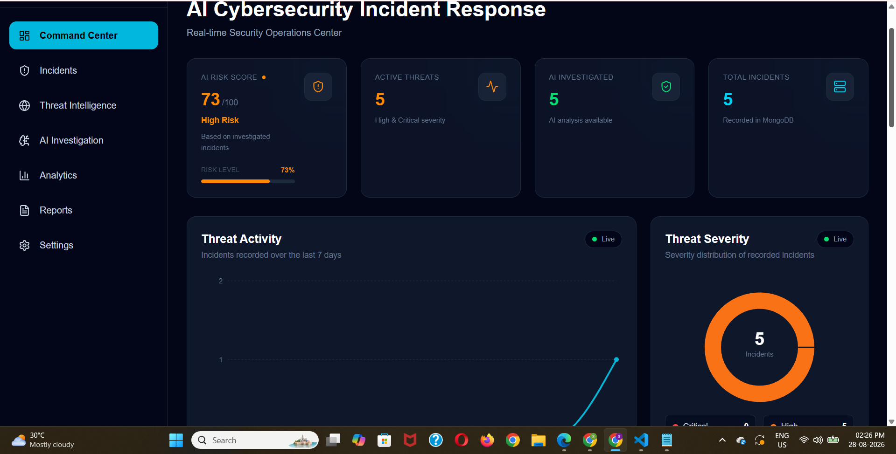
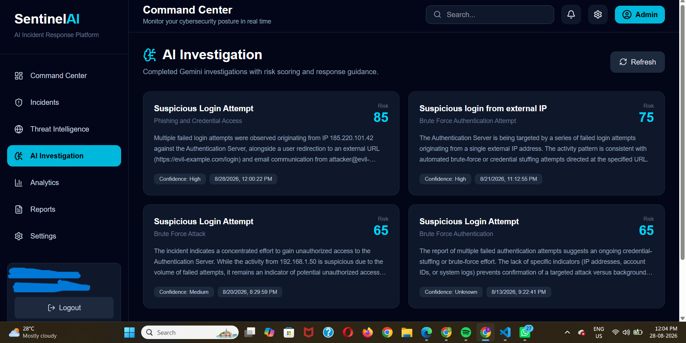
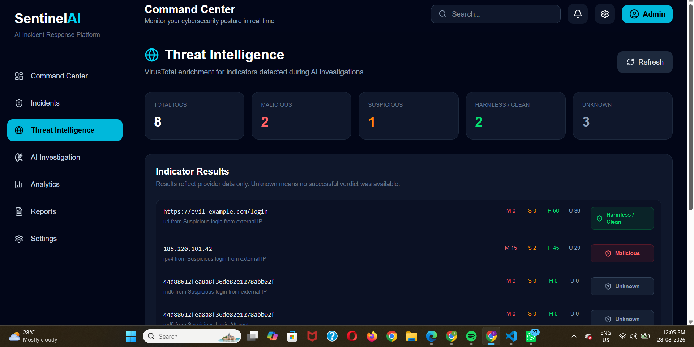
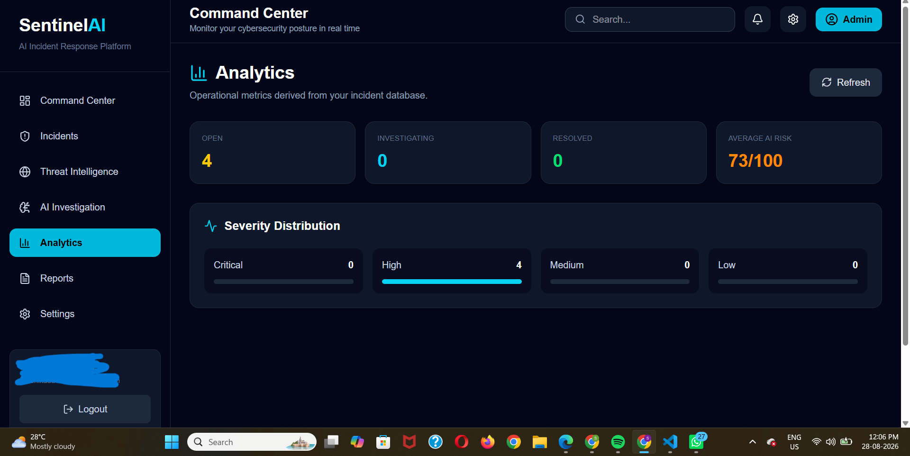
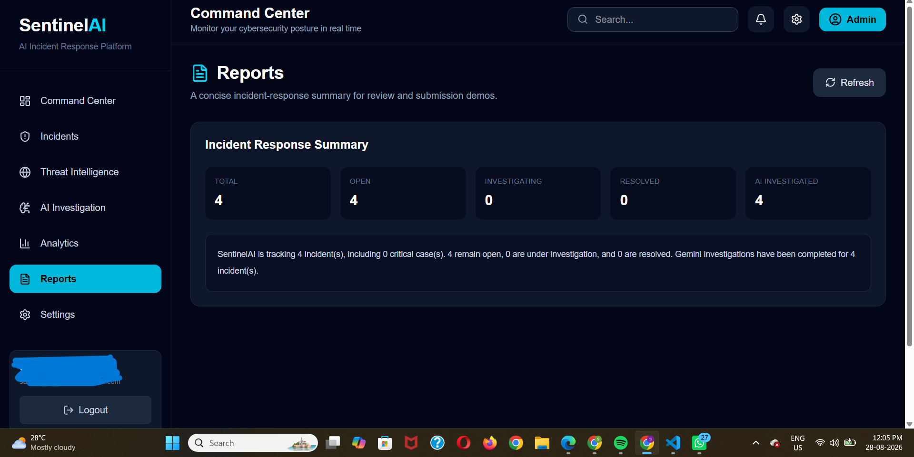
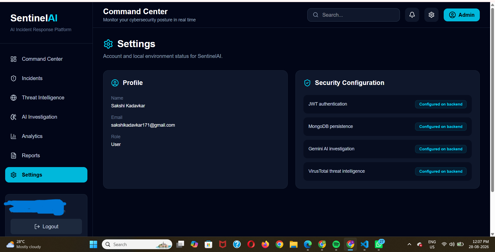

# SentinelAI

### AI-Powered Cybersecurity Incident Response Platform

> Detect. Investigate. Analyze. Respond.

SentinelAI is a full-stack cybersecurity platform designed to help security analysts investigate incidents, analyze threats, work with indicators of compromise, and monitor security activity through a centralized dashboard.

---

## Live Demo

**Application:**  
https://sentinel-ai-one-tau.vercel.app/

**Backend API:**  
https://sentinelai-backend-as53.onrender.com/

**Source Code:**  
https://github.com/sakshikadavkar/SentinelAI

---

## Product Preview



---

## Why SentinelAI?

Modern security teams deal with large amounts of alerts, suspicious indicators, and incident data.

SentinelAI brings these workflows into a single interface with:

- AI-assisted security investigation
- Incident management
- Threat intelligence
- IOC analysis
- Security analytics
- Incident reporting
- Secure authentication

The goal is to reduce investigation complexity and give analysts a centralized workspace for security operations.

---

# Core Capabilities

### AI Investigation

Use AI-assisted analysis to investigate security incidents and generate actionable security insights.



---

### Threat Intelligence

Analyze suspicious indicators and support threat investigation through integrated threat intelligence capabilities.



---

### Security Analytics

Visualize security activity and incident trends through an interactive analytics dashboard.



---

### Incident Reports

Review and organize security incident information through structured reports.



---

### Security Management

Manage application and security-related settings through a centralized interface.



---

# Technology Stack

## Frontend

- React 19
- Vite
- Tailwind CSS 4
- React Router
- Axios
- Framer Motion
- Recharts
- React Hook Form
- Lucide React

## Backend

- Node.js
- Express.js
- MongoDB
- Mongoose
- JWT
- bcryptjs
- Axios
- CORS
- dotenv

## AI & Security

- Google Gemini API
- JWT Authentication
- bcrypt Password Hashing
- Threat Intelligence APIs

---

# Architecture

```text
                         SENTINELAI
                              |
                              v
                    +-------------------+
                    |   React Frontend  |
                    | Vite + Tailwind   |
                    +---------+---------+
                              |
                              | REST API
                              | Axios
                              v
                    +-------------------+
                    |  Node.js + Express |
                    |     Backend API     |
                    +---------+-----------+
                              |
             +----------------+----------------+
             |                |                |
             v                v                v
      +-------------+  +-------------+  +-------------+
      |   MongoDB   |  |   Gemini    |  | Threat Intel|
      |   Database  |  |     AI      |  |    APIs     |
      +-------------+  +-------------+  +-------------+
             |                |                |
             +----------------+----------------+
                              |
                              v
                    +-------------------+
                    | Security Analysis |
                    | & Incident Response|
                    +---------+---------+
                              |
                              v
                    +-------------------+
                    | Security Dashboard|
                    | Analytics & Reports|
                    +-------------------+